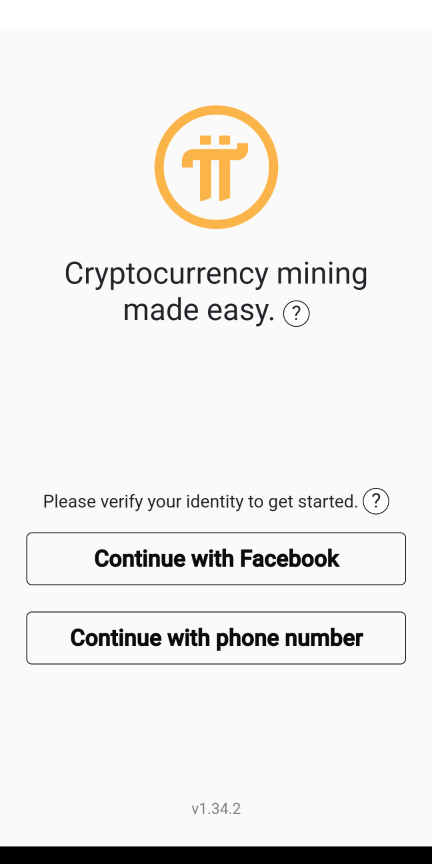
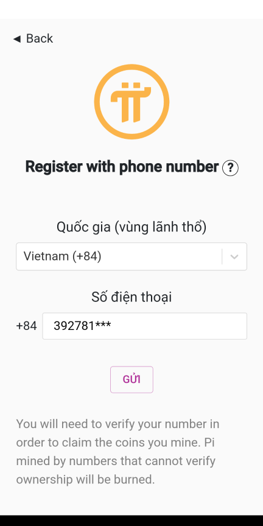
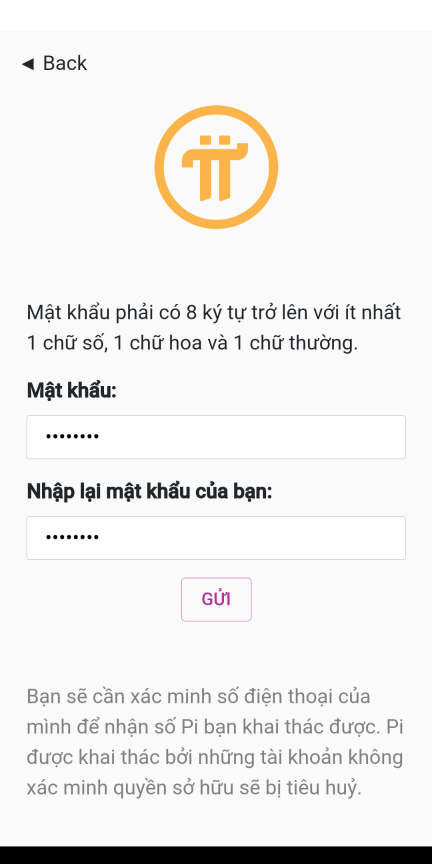
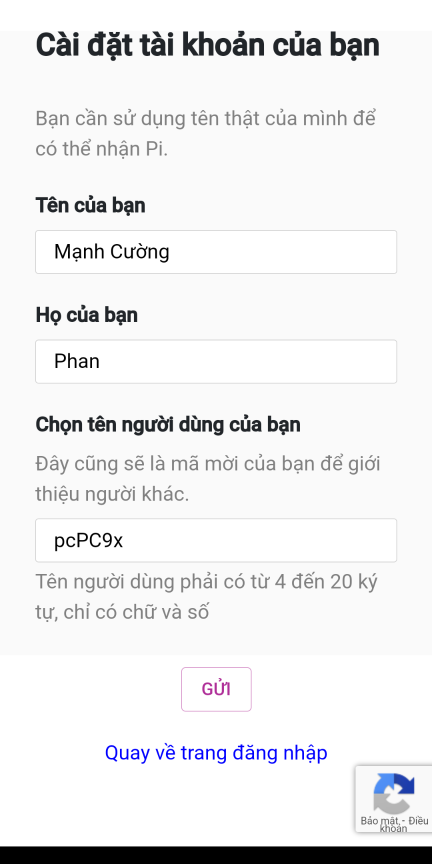
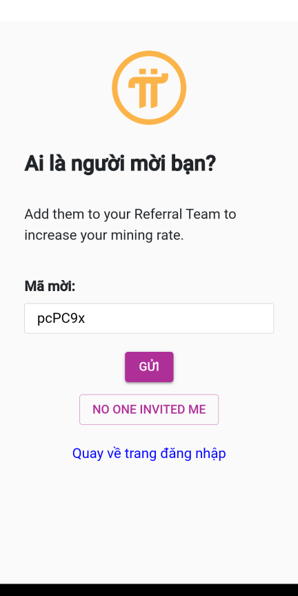

# Tạo tài khoản Pi Network
Vào trang [minepi.com](https://minepi.com/pcPC9x) để tải ứng dụng cho điện thoại (Android/ iOS)
Sau khi tải và cài đặt ứng dụng Pi trên điện thoại, tiến hành tạo tài khoản để bắt đầu khai thác Pi. Các hướng dẫn, chú thích rất cụ thể khi thao tác trên ứng dụng. Mọi người nhớ để ý và làm cho đúng nha.
1. Đăng ký sử dụng số điện thoại để xác thực: Nhấn Continue with phone number

2. Khai báo số điện thoại
- Chọn mã vùng Vietnam (+84)
- Nhập số điện thoại (098xxxx nhập thành 98xxxx)
- Nhấn GỬI

3. Nhập mật khẩu
- Mật khẩu phải có 8 ký tự trở lên với ít nhất 1 chữ số, 1 chữ hoa và 1 chữ thường.
- Nhấn GỬI

4. Nhập họ tên
- Bạn cần sử dụng tên thật của mình để có thể nhận Pi.
- Tên của bạn (nhập tên đệm và tên bạn)
- Họ của bạn (nhập họ)
- Chọn tên người dùng của bạn (nickname), đây cũng sẽ là mã mời của bạn để giới thiệu người khác, tên người dùng là duy nhất, không được trùng với người khác.
- Nhấn GỬI

5. Ai là người mời bạn?
- Nhập mã mời pcPC9x để tăng tốc độ khai thác Pi
- Nhấn GỬI
- Nếu bạn không có mã mời, nhấn NO ONE INVITED ME, thì tốc độ khai thác sẽ ít hơn

***Vậy là hoàn thành đăng ký tài khoản. Hoạt động đơn giản và thường xuyên bạn phải làm là kích tia sét sau mỗi 24h.***
Ngoài ra, từ ứng dụng Pi, bạn cần làm thêm một số thao tác nữa như tạo vòng tròn bảo mật, đặt tỷ lệ khoá, tạo ví... các hướng dẫn đều có trong ứng dụng Pi. Hãy vào các mục sau để thêm thông tin:
- Menu (góc trên cùng bên trái) -> FAQ: Các câu hỏi thường gặp, thông tin cơ bản nhất về dự án
- Menu -> Sách trắng: Bản tuyên ngôn của dự án (viết bằng tiếng anh)
- Menu -> Trò chuyện (hoặc nhấn biểu tượng Chat trên màn hình): Các phòng chat chia theo quốc gia, chủ đề. Vào phòng Pioneers (Tiếng Việt) -> Mods FAQ để xem thêm các thông tin từ người quản lý.
- Menu -> Theo dõi chúng tôi -> Biểu tượng Youtube: Xem các hướng dẫn bằng video (rất trực quan)
- Còn rất nhiều mục khác nữa đang chờ bạn khám phá
